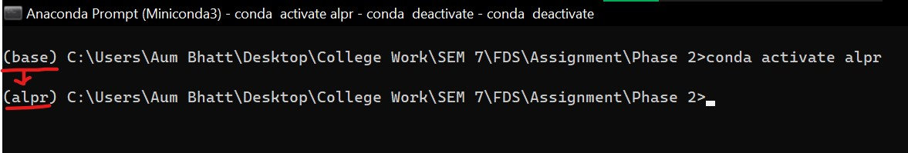
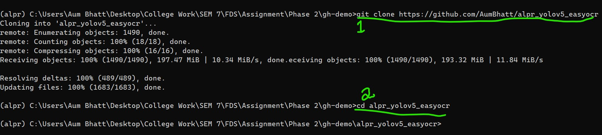

# Automatic License Plate Recognition (ALPR)
 <p align="right">By Aum Bhatt & Prassanna Gale Balaji </p>

### A demonstration project for **Foundation of Data Science (CS F320)** @ BITS Pilani, Dubai Campus.
<br>
<br>

## Step 1: Install Miniconda
Miniconda is a lightweight version of Anaconda which is a virtual environment tool to isolate and manage packages and deployment.<br>
Link: https://docs.conda.io/en/latest/miniconda.html#

## Step 2: Setting up a conda environment
Open miniconda as administrator / elevated privilages and type the following commands:
```bash
conda create -n [name]
```
where [name] can be replaced with desired name of environment.

We are naming our environment as ***alpr***.<br>
```bash
conda create -n alpr -y
```

## Step 3: Activating/Deactivating our conda environment

1. In order to use our environment, we need to activate in conda by using this command:
   ```bash
   conda activate alpr
   ```
   This will activate our environment and the name will change from ***base*** to ***alpr*** (left most).
   

2. The environment gets automatically deactivated ones you close conda window or by use of this command:
   ```bash
   conda deactivate
   ```

## Step 4: Cloning the project
1. To clone the project on your system use the following command:
   ```bash
   git clone https://github.com/AumBhatt/alpr_yolov5_easyocr
   ```
2. Then change directory to the project folder by using this command:
   ```bash
   cd alpr_yolov5_easyocr
   ```
It should look something like this:


## Step 5: Instaling easyocr and it's dependencies
1. Install *easyocr* using this command:
   ```bash
   pip install easyocr
   ```
2. Install *opencv* using this command:
   ```bash
   pip install opencv-python
   ```
3. Install *pytorch* using this command
   ```bash
   pip install torch torchvision torchaudio
   ```